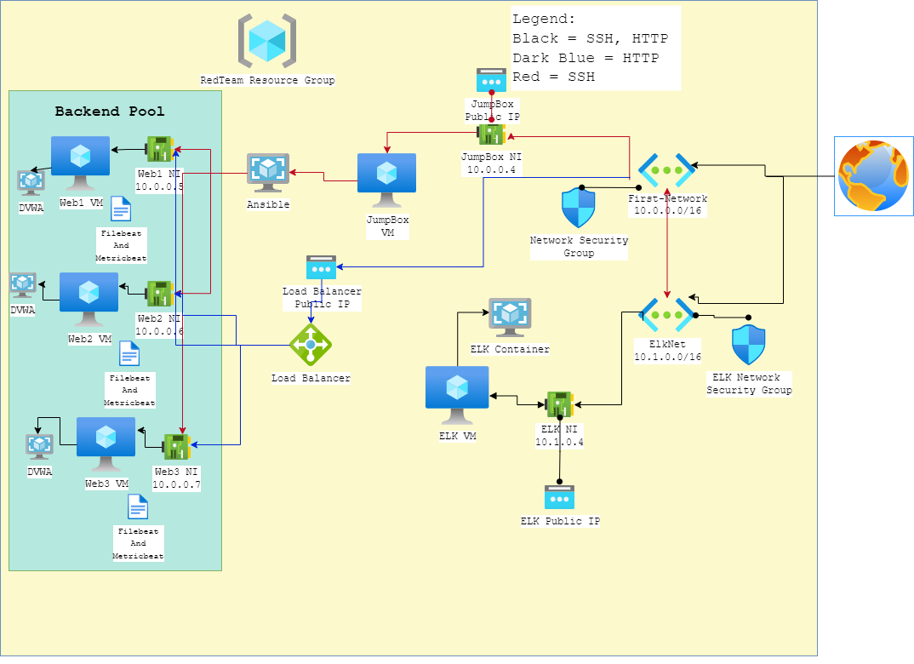
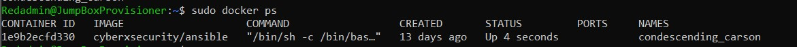

## Automated ELK Stack Deployment

The files in this repository were used to configure the network depicted below.

**Note**: The following image link needs to be updated. Replace `diagram_filename.png` with the name of your diagram image file.  

 

These files have been tested and used to generate a live ELK deployment on Azure. They can be used to either recreate the entire deployment pictured above. Alternatively, select portions of the playbook file may be used to install only certain pieces of it, such as Filebeat.

  - _[YAML Files](Ansible)._

This document contains the following details:
- Description of the Topologu
- Access Policies
- ELK Configuration
  - Beats in Use
  - Machines Being Monitored
- How to Use the Ansible Build


### Description of the Topology

The main purpose of this network is to expose a load-balanced and monitored instance of DVWA, the D*mn Vulnerable Web Application.

Load balancing ensures that the application will be highly available, in addition to restricting access to the network.
- _What aspect of security do load balancers protect? What is the advantage of a jump box?
- Load balancing takes an important security role in helping to protect from cyber attacks. Distributed Denial-of-Service (DDoS) attacks is just one example of many. The load balancer helps by distributing traffic amongst between servers to lighten the load of malious traffic. One benefit in using a jump box is that it has restricted access and protects your virtual machine from the internet. _

Integrating an ELK server allows users to easily monitor the vulnerable VMs for changes to the log files and system metrics. 
- _Log files monitored by Filebeat_
- _Metrics monitored by Metricbeat_

The configuration details of each machine may be found below.
_Note: Use the [Markdown Table Generator](http://www.tablesgenerator.com/markdown_tables) to add/remove values from the table_.

| Name     | Function | IP Address | Operating System |
|----------|----------|------------|------------------|
| Jump Box | Gateway  | 10.0.0.1   | Linux            |
| Web 1    | VM       | 10.0.0.5   | Unbuntu 20.04    |
| Web 2    | VM       | 10.0.0.6   | Unbuntu 20.04    |
| Web 3    | VM       | 10.0.0.7   | Unbuntu 20.04    |
| ElkVM    |ELK stack | 10.1.0.4   | Unbuntu 20.04    |

### Access Policies

The machines on the internal network are not exposed to the public Internet. 

Only the Jump Box machine can accept connections from the Internet. Access to this machine is only allowed from the following IP addresses:
- _Load Balancer's Public IP (40.77.13.225)_

Machines within the network can only be accessed by Jump Box Provisioner's Ansible Container via SSH.
- _I used the Jump Box Provisioner's Ansible container, using the IP address 10.0.0.4_

A summary of the access policies in place can be found in the table below.

| Name     | Publicly Accessible | Allowed IP Addresses    |
|----------|---------------------|-------------------------|
| Jump Box | No                  |Local machines public IP |
|  Web 1   | Yes                 |    Internet             |
|  Web 2   | Yes                 |    Internet             |
|  Web 3   | Yes                 |    Internet             |
|  ELKVM   |  No                 |    10.0.0.4             |

### Elk Configuration

Ansible was used to automate configuration of the ELK machine. No configuration was performed manually, which is advantageous because...
- _The main advantage is Ansible can ensure that provisioning scripts can be identically running between systems and users._

The playbook implements the following tasks:
- _Checks and installs docker.io_
- _Checks and installs python3-pip_
- _Checks and installs docker module (python)
- _Virtual memory increases
- _Checks, downloads, then runs elk container with the published ports
- Enables docker service on boot

The following screenshot displays the result of running `docker ps` after successfully configuring the ELK instance.



### Target Machines & Beats
This ELK server is configured to monitor the following machines:
- _10.0.0.5, 10.0.0.6, 10.0.0.7_

We have installed the following Beats on these machines:
- _Filebeat_
- _Metricbeat_

These Beats allow us to collect the following information from each machine:
- _Filebeat collects the log files and system logs_
- _Metricbeat collects the different metrics for Network, CPU, and other services_

### Using the Playbook
In order to use the playbook, you will need to have an Ansible control node already configured. Assuming you have such a control node provisioned: 

SSH into the control node and follow the steps below:
- Copy the configELK.yml file and the playbooks to etc/ansible.
```
curl https://columbia.bootcampcontent.com/columbia-bootcamp/CU-VIRT-CYBER-PT-02-2022-U-LOL/-/raw/main/13-ELK-Stack-Project/Activities/Stu_Day_1/Unsolved/Resources/install-elk.yml > configELK.yml
```
- Update the host file to include the private IP addresses of the machines you wish to install and configure ELK in.
```
nano /etc/ansible/hosts
# add [elk]
# add Private IP address 10.1.0.4
```
- Run the playbook, and navigate to Kibana (Public_IP:5601) to check that the installation worked as expected.


- _Which file is the playbook? Where do you copy it?_
   The YAML playbook file is provided, you would take that and copy it into the /etc/ansible directory in the ansible container
   
- _Which file do you update to make Ansible run the playbook on a specific machine? How do I specify which machine to install the ELK server on versus which to install Filebeat on?_
  You have to make sure that you go in and update the hosts files by adding the private IP address of the machine you would like to install ELK or Filebeat on.
  
- _Which URL do you navigate to in order to check that the ELK server is running?
   http://[PublicIP]:5601/app/Kibana
### Running the Playbooks:
To run the playbooks for the ansible installation you will run:
 - ansible-playbook (name-of-playbook)
